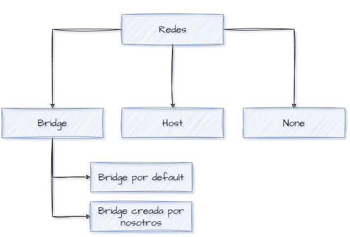

# Redes
Las redes son un componente fundamental que permite la comunicación entre contenedores, así como la comunicación de los contenedores con el mundo exterior. 

- Bridge: Esta es la red por defecto en Docker. Permite la comunicación entre contenedores en el mismo host. Cada contenedor conectado a la red bridge tiene una IP propia en la subred de la red bridge.
    -  Brige por default: Cuando se ejecuta un contenedor, Docker crea automáticamente una red de tipo bridge por default. Esta red se utiliza para permitir la comunicación entre contenedores en el mismo host. Cada contenedor conectado a esta red obtiene su propia dirección IP en la subred de la red bridge.
    - Bridge creada por nosotros: Un usuario también puede crear sus propias redes de tipo bridge en Docker. Esto puede ser útil para organizar y segmentar los contenedores de una aplicación de manera más controlada. Al crear una red bridge personalizada, se puede especificar un rango de direcciones IP y otras configuraciones de red específicas. Los contenedores conectados a esta red utilizarán las direcciones IP de la subred definida por el usuario.
- Host: Con esta red, los contenedores comparten la red del host en lugar de tener su propia interfaz de red. Esto puede mejorar el rendimiento de red, pero los contenedores pueden entrar en conflicto con los puertos del host si intentan utilizar los mismos puertos.
- None: Con esta red, se deshabilita la configuración de red. Los contenedores que usan esta red tienen su propia red de bucle invertido y no pueden comunicarse con otros contenedores a menos que se conecten explícitamente a una red.

### Crear una red de tipo bridge

```
docker network create <nombre red> -d bridge
```

### Crear un contenedor vinculado a una red

```
docker run -d --name <nombre contenedor> --network <nombre red> <nombre imagen>
```

### Para saber a qué red está conectado un contenedor

```
docker inspect <nombre contenedor>
```
ó
```
docker network inspect <nombre red> 
```

### Vincular contenedor a una red
```
docker network connect <nombre red> <nombre contenedor>
```

### Para desvincular un contenedor de una red
```
docker network disconnect <nombre red> <nombre contenedor>
```

### Para listar las redes existentes
```
docker network ls
```

### Crear los contenedores y las redes que se presentan en el esquema. Usar para todos los contenedores la imagen de nginx:alpine


### Paso 1: Crear las Redes
Primero, creare las dos redes net-curso1 y net-curso2 de tipo bridge como se muestra a continuación.

```
docker network create net-curso01 -d bridge
docker network create net-curso02 -d bridge 
```


### Paso 2: Crear los contenedores y vincularlos a sus respectivas redes.

#### Con respecto al Contenedor 1 y 2 en net-curso01:

```
docker run -d --name contenedor1 --network net-curso01 nginx:alpine
docker run -d --name contenedor2 --network net-curso01 nginx:alpine
```


#### Contenedor 3 en ambas redes net-curso01 y net-curso02

```
docker run -d --name contenedor3 --network net-curso01 nginx:alpine
docker network connect net-curso02 contenedor3
```


#### Contenedor 4 en net-curso02:

```
docker run -d --name contenedor4 --network net-curso02 nginx:alpine
```


### Verificar las Conexiones:

Se inspecciona las conexiones esten conectadas a las redes correctas mediante los siguiente comandos. 

```
docker inspect contenedor1
docker inspect contenedor2
docker inspect contenedor3
docker inspect contenedor4
```
Pero por facilidad se va a inspeccion por redes creadas. 
## Inspeccion por Redes 

```
docker network inspect net-curso01 
docker network inspect net-curso02
```

### Capturas de la estructura creada:

#### Enlistar las Redes creadas 


Notemos como en la net-curso01 Se encuentra el contenedor1, contenedor2 y contenedor 3.


Notemos como en la net-curso02 Se enecuentra el contenedor3 y contedor4. 


# Eliminar las redes creadas.


