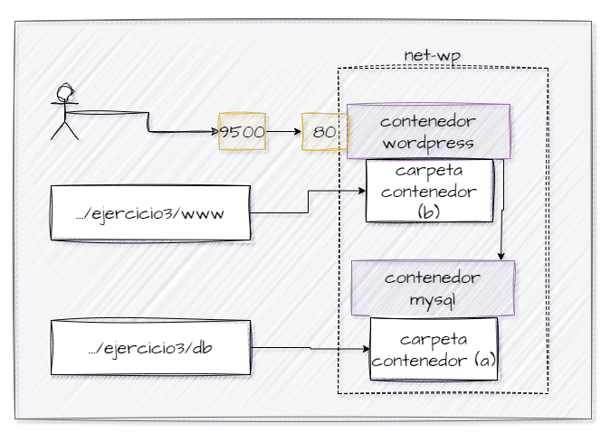

## Esquema para el ejercicio


### Crear red net-wp

```
docker network create net-wp
```


### Para que persista la información de MySQL, necesitamos saber dónde almacena la información en el contenedor. Según la documentación de la imagen mysql:8, la ruta es /var/lib/mysql.

En el esquema del ejercicio la carpeta contenedor (a) es /var/lib/mysql Ruta carpeta host: .../ejercicio3/db

### ¿Qué contiene la carpeta db del host?

Inicialmente, la carpeta db del host está vacía. Después de iniciar el contenedor MySQL, contendrá los archivos de la base de datos.

### Crear un contenedor con la imagen mysql:8  en la red net-wp, configurar las variables de entorno: MYSQL_ROOT_PASSWORD, MYSQL_DATABASE, MYSQL_USER y MYSQL_PASSWORD

```
docker run -d --name mi_mysql --network net-wp -v C:\Users\mateo\Documents\Practica3\db:/var/lib/mysql -e MYSQL_ROOT_PASSWORD=rootpassword -e MYSQL_DATABASE=wordpress -e MYSQL_USER=wpuser -e MYSQL_PASSWORD=wppassword mysql:8
```


### ¿Qué observa en la carpeta db que se encontraba inicialmente vacía?

Después de iniciar el contenedor MySQL, la carpeta db en el host contendrá archivos y directorios correspondientes a las bases de datos MySQL, como ibdata1, ib_logfile0, y directorios de bases de datos.

### Para que persista la información es necesario conocer en dónde wordpress almacena la información.
Para que persista la información de WordPress, necesitamos saber dónde almacena la información en el contenedor. Según la documentación de la imagen wordpress, la ruta es /var/www/html. Ruta carpeta host: .../ejercicio3/www

### Crear un contenedor con la imagen wordpress en la red net-wp, configurar las variables de entorno WORDPRESS_DB_HOST, WORDPRESS_DB_USER, WORDPRESS_DB_PASSWORD y WORDPRESS_DB_NAME (los valores de estas variables corresponden a los del contenedor creado previamente)


```
docker run -d --name mi_wordpress --network net-wp -p 9500:80 -v C:\Users\mateo\Documents\Practica3\www:/var/www/html -e WORDPRESS_DB_HOST=mi_mysql:3306 -e WORDPRESS_DB_USER=wpuser -e WORDPRESS_DB_PASSWORD=wppassword -e WORDPRESS_DB_NAME=wordpress wordpress
```


### Personalizar la apariencia de wordpress y agregar una entrada

### Eliminar el contenedor y crearlo nuevamente, ¿qué ha sucedido?
```
docker rm -f mi_wordpress
docker run -d \
  --name mi_wordpress \
  --network net-wp \
  -p 9500:80 \
  -v C:\Users\mateo\Documents\Practica3\www:/var/www/html \
  -e WORDPRESS_DB_HOST=mi_mysql:3306 \
  -e WORDPRESS_DB_USER=wpuser \
  -e WORDPRESS_DB_PASSWORD=wppassword \
  -e WORDPRESS_DB_NAME=wordpress \
  wordpress
```
Al eliminar el contenedor y crearlo nuevamente, las personalizaciones y las entradas agregadas anteriormente deberían persistir porque los datos están almacenados en el volumen montado desde el host. Esto asegura que cualquier cambio realizado en WordPress se mantenga, incluso si el contenedor es eliminado y recreado.


